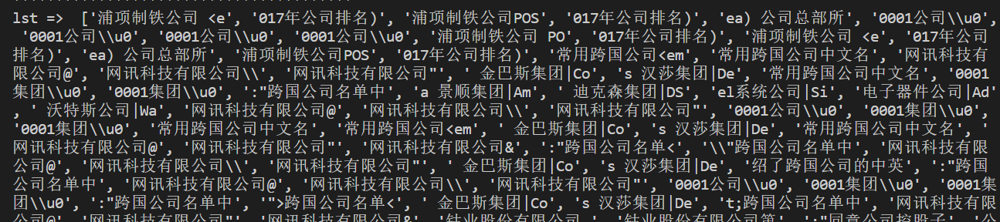

### 2022.3.8

使用chatgpt可以实现不错的翻译

### 原需求

一个奇怪的需求，将英文公司名翻译成中文名

比如: 

以下分别为 公司名字，所在地，国家或地区。

| Actividades de Constrccn y Srvcos SA | ES | 西班牙 |  |  |  |  |
| ------------------------------------ | -- | ------ | - | - | - | - |

不管用什么办法需要得到其英文名称

已有的办法:

1. 使用搜索引擎进行查找
   1. 我使用的方式为bing + baidu, 后来转变为百度，百度对中文的支持相对好一些

      - 搜索方式为:  keyWord +"中文名", 如 "Posco 中文名"
      - 爬取搜索引擎的结果，在搜索结果页面进行正则匹配公司，集团等字样，但是效果一般，准确率10%？

        |  | 搜索 | Posco | 正确的翻译为 |  |
        | - | ---- | ----- | ------------ | - |

        |  |  | 韩国浦项钢铁公司 |  |  |
        | - | - | ---------------- | - | - |

        

        难以凭借一般的办法如出现频次大小等筛选出正确的结果

最后的办法，使用翻译引擎但是可能得到的不是官方的名称☹

#### 结果

1法 效果并不理想，出现了比较多的问题:

1. 可能得到的全是英文界面，无中文
2. 搜索不到结果
3. 匹配困难
4. ...

#### TODO

还需要继续想更好的办法

一些数据:

| CORPORATION                    | JP | 日本     |  | 莱恩帕里斯二十一株式会社 |
| ------------------------------ | -- | -------- | - | ------------------------ |
| Airbus SE                      | NL | 荷兰     |  | 空中客车集团             |
| Nitori Holdings Co Ltd         | JP | 日本     |  | 尼达利集团               |
| Nankang Rubber Tire Corp.,     |    |          |  |                          |
| Ltd.                           | TW | 台湾省   |  | 南港輪胎股份有限公司     |
| Nan Ya Plastics Corp           | TW | 台湾省   |  | 南亚塑胶工业股份有限公司 |
| Sonae Industria Sgps SA        | PT | 葡萄牙   |  |                          |
| International Power plc        | GB | 英国     |  | 国际电力公司             |
| SSE PLC                        | GB | 英国     |  | 南苏格兰电力公司         |
| Oceana Group Ltd               | ZA | 南非     |  |                          |
| ACS Actividades de Constrccn y |    |          |  |                          |
| Srvcos SA                      | ES | 西班牙   |  | 西班牙ACS建筑公司        |
| Pohjola Bank plc               | FI | 芬兰     |  | 芬兰波赫约拉银行         |
| Omnia Holdings Limited         | ZA | 南非     |  | 奥尼亚控股有限公司       |
| OMX AB                         | SE | 瑞典     |  | 瑞典欧麦克斯集团         |
| Doosan Corp                    | KR | 韩国     |  | 韩国斗山集团             |
| Meritz Fire & Marine           |    |          |  |                          |
| Insurance Co Ltd               | KR | 韩国     |  | 美林火灾海上保险股份公司 |
| OrotonGroup Limited            | AU | 澳大利亚 |  | 奥罗顿集团               |
| Ford Otomotiv Sanayi AS        | TR | 土耳其   |  | 福特奥托生               |
